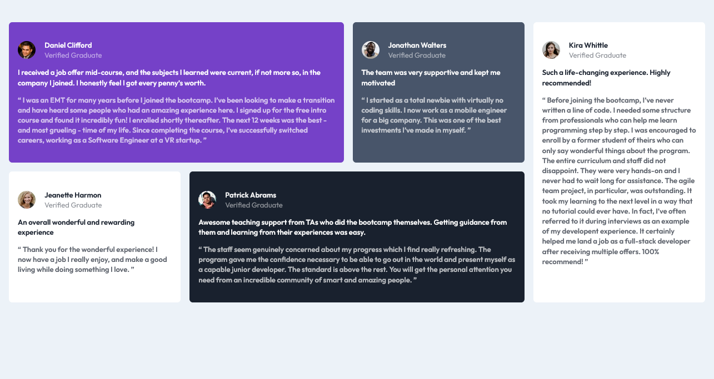

# Title

## Table of contents

- [Overview](#overview)
  - [Screenshot](#screenshot)
  - [Links](#links)
- [My process](#my-process)
  - [Built with](#built-with)
  - [What I learned](#what-i-learned)
  - [Continued development](#continued-development)
  - [Useful resources](#useful-resources)
- [Author](#voqh)

**Note: Delete this note and update the table of contents based on what sections you keep.**

## Overview

### Screenshot

### Links

- Solution URL: [https://github.com/Voqh/testimonials-grid-section-main.git]
- Live Site URL: [https://voqh.github.io/testimonials-grid-section-main/]

## My process

### Built with

- Semantic HTML5 markup
- CSS custom properties
- Flex-box
- CSS Grid
- Mobile-first workflow

### What I learned

CSS Grid: Using the grid-template-area property to create grid layout.

### Continued development

css Grid

## Author

- Frontend Mentor - [@voqh](https://www.frontendmentor.io/profile/voqh)
- Twitter - [@voqh_ke](https://www.twitter.com/voqh_ke)
